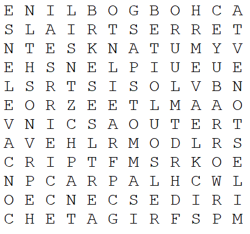
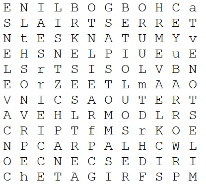

# Puzzle-Solver
This is a word puzzle solver written in C++

**Preface:** Inspiration to develop this program came from playing a word puzzle game called "Word Search" for the iOS.

 This is the face of the puzzle that this program will work on.

    

  
  
  

The word bank that the player must find can be observed in the upper part of the image, the white words with the bluish/violet background.

 

    

And the grid of letters that the player must find the words in.

 

    

This is the list of words that need to be found within the extracted grid.

 

The word bank post-extraction.

 

    

Once the program completes, it will produce a text file containing all of the words that were defined in the word bank text file.

 

**NOTE:** The words that were defined in the word bank, and subsequently found by the program, will be in uppercase, while the words that are not of interest remain lowercased.

    

In these images, I highlighted the outputs with a red line, to make it easier to see the words that were found by the program.

 

    

And the locations within the puzzle body.

 

 

    

